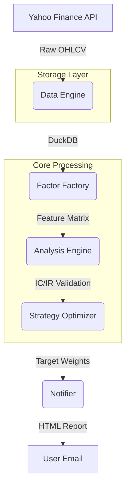

# 🏗️ 系統架構與設計說明 (System Architecture & Design)

本文檔詳細說明了「通用型自動理財系統」的技術架構、設計理念以及各模組的運作邏輯。本系統旨在透過嚴謹的統計學方法，為長期理財提供客觀、自動化且低磨損的決策支援。

---

## 1. 系統架構圖 (System Architecture)

系統採用**線性流水線 (Linear Pipeline)** 架構，確保數據流向單向且可追蹤。

---

## 2. 核心模組設計說明

### 2.1 資料引擎 (Data Engine)
*   **技術棧**: `yfinance`, `DuckDB`
*   **核心邏輯**: 
    *   **增量更新 (Incremental Updates)**: 自動查詢資料庫內各標的的 `max(timestamp)`，僅下載缺失的時間區段，大幅提升運行速度並節省 API 配額。
    *   **資料清洗**: 執行 Forward Fill 補齊缺失價格，並計算對數收益率 (Log Returns) 作為基礎特徵。
    *   **高效儲存**: 使用 DuckDB 進行嵌入式儲存，支援極速的 OLAP 查詢與 PIVOT 運算。

### 2.2 因子工廠 (Factor Factory)
*   **關鍵技術**: `Fractional Differentiation`, `Multiprocessing`
*   **設計重點**:
    *   **動態分數階微分 (Dynamic FracDiff)**: 這是系統的核心技術。透過 ADF 檢定動態搜尋最小的微分階數 $d$，在確保數據平穩性（適合統計預測）的同時，儘可能保留原始價格的「長期記憶」。
    *   **並行計算**: 使用 `ProcessPoolExecutor` 同時計算 20+ 個標的的特徵，將計算時間縮短 3-5 倍。
    *   **數據穩健化**: 對因子執行 Winsorization (去極值) 與 Rank Scaling (排序標準化)，確保單一資產的極端表現不會誤導整體配置。

### 2.3 分析引擎 (Analysis Engine)
*   **設計理念**: 「統計顯著性高於直覺」。
*   **核心功能**:
    *   **IC/IR 分析**: 計算因子得分與未來回報的 **Spearman Rank Correlation (IC)**。
    *   **動態權重**: 根據因子的歷史穩定性 (Information Ratio, IR) 自動分配合成信號的權重，表現越穩定的因子佔比越高。

### 2.4 策略優化器 (Strategy Optimizer)
*   **設計理念**: 「風險控管是理財的生命線」。
*   **關鍵邏輯**:
    *   **風險平價 (Risk Parity)**: 基於 Inverse Volatility 分配權重。確保每個資產對組合總風險的貢獻是均衡的。
    *   **適應性調倉緩衝 (Adaptive Buffer)**: 門檻隨市場波動度縮放。在震盪市中調高門檻以避免手續費磨損，在平穩市中調低門檻以追求精確。
    *   **硬性合規**: 強制執行單一標的 20% 上限，並根據得分動態決定是否空倉 (Cash-out)。

---

## 3. 設計哲學 (Design Philosophy)

1.  **真實性 (Realism)**: 系統在回測中主動計入 0.1% 的交易成本與動態摩擦。我們追求的是「在現實中能賺到的錢」，而非「漂亮的曲線」。
2.  **魯棒性 (Robustness)**: 優先使用線性統計模型與經典量化因子，避免複雜模型在短樣本下產生的過擬合問題。
3.  **自動化避險**: 系統具備主動空倉機制。當市場整體統計期望值為負時，報告會建議持倉 0%，這體現了「保存實力」的專業理財觀。

---

## 4. 技術規格摘要 (Tech Stack)

| 分類 | 技術工具 |
| :--- | :--- |
| **程式語言** | Python 3.9 |
| **資料庫** | DuckDB (極速嵌入式資料庫) |
| **容器化** | Docker, Docker Compose |
| **統計學** | Scipy, Statsmodels, Pandas |
| **任務排程** | APScheduler (美東時間 08:30 定時) |

---
